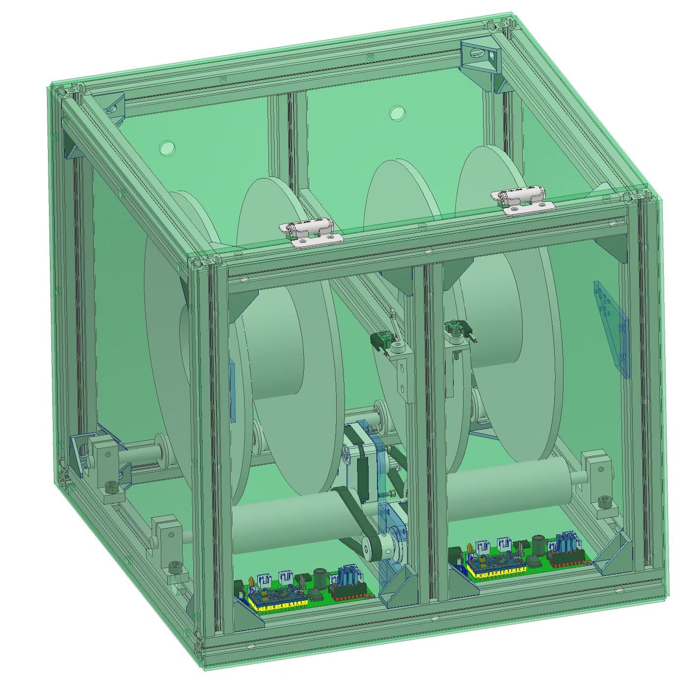
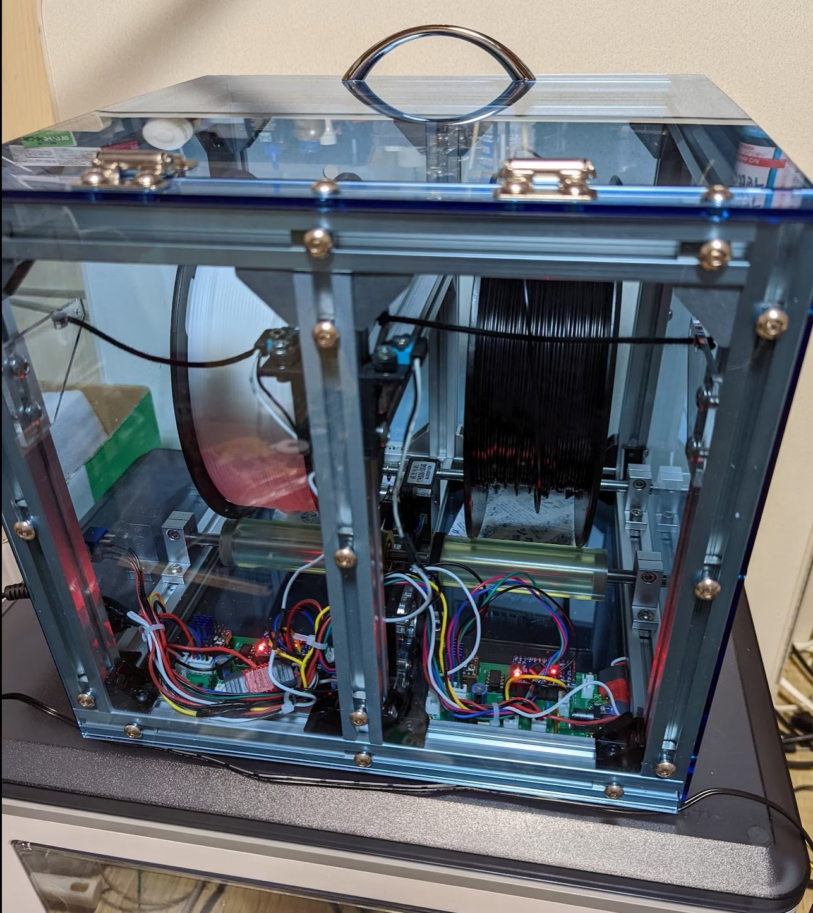

# Filament Spool Feeder for Direct-Drive 3D Printers
# ダイレクト式3Dプリンタ用 フィラメントスプールフィーダー

[日本語](#日本語) | [English](#english)

---

## 日本語

### 概要

ダイレクト式（エクストルーダーがヘッドに載っている方式）の3Dプリンタでは、フィラメントをスプールから引き出す力がすべてエクストルーダーにかかります。次のような場面で、フィラメントの引き込みに抵抗がかかり、吐出量が減って品質が落ちます。

- スプールが重い（特に1kg）
- 高速で印刷する
- ノズルがテーブル上でXY方向に大きく移動し、その移動量の分だけフィラメントが引っ張られる

広い部屋ならスプールをプリンタから離して、遊びのフィラメントを長く取れば防げますが、ホビー用途ではその場所がありません。このフィーダーは、ボーデン式とダイレクト式を組み合わせる考え方で、スプールを能動的に回してフィラメントを先に送り出しておく装置です。

### しくみ

1. スプールをウレタンローラーに載せ、ステッピングモーターでGT2ベルトを介してローラーを回します。
2. フィラメントはゴム紐につながったレバーを通ります。一定以上引っ張られるとスイッチが入り、モーターが回ってスプールから送り出します。
3. スイッチが切れた後も一定量（4000ステップ）送り出してから止まります。フィラメントは使用量より多めに送り出され、ゴム紐の伸びとフィラメントのたるみで200mm以上の余裕ができます。
4. 送り要求が異常に長く続いた場合（ジャム）は、独立したマイコン（ATtiny85）がリレーでモーター電源を切り、停止状態を保持します。

詳しくは [docs/principle.md](docs/principle.md) を参照してください。

### リポジトリの構成

| フォルダ | 内容 |
|:--|:--|
| [firmware/](firmware/) | Arduino Pro Mini（メイン制御）と ATtiny85（ジャム監視）のファームウェア |
| [hardware/pcb/](hardware/pcb/) | 制御基板 rev.B（EAGLE データ、回路図 PDF、BOM） |
| [hardware/mechanical/](hardware/mechanical/) | 機構部品（組立外形図、自作部品の STEP データ、BOM） |
| [docs/](docs/) | 原理、配線、画像 |
| [tools/sim/](tools/sim/) | ファームの検証に使った AVR シミュレーション環境 |

### はじめに

1. 機構: [hardware/mechanical/](hardware/mechanical/) の組立外形図、BOM、自作部品の STEP データで組み立てます。
2. 基板: [hardware/pcb/](hardware/pcb/) の EAGLE データで製作します。配線は [docs/wiring.md](docs/wiring.md) にあります。
3. ファーム: [firmware/](firmware/) の手順で、Pro Mini と ATtiny85 に書き込みます。rev.B 基板では、ATtiny85 のファームの `EXT_SENSE_ENABLED` を 1 にします。

### 状態表示LED（改版基板 rev.B）

| LED | 意味 |
|:--|:--|
| 点灯 | 送り要求中 |
| ゆっくり点滅（約1秒周期） | モータードライバが使えない（ジャム監視がモーター電源を切った、など） |
| 速い点滅（約0.25秒周期） | 異常で停止・保持中（リセットで復帰） |
| 消灯 | 待機中 |

### ライセンス

| 対象 | ライセンス |
|:--|:--|
| ハードウェア設計（hardware/） | [CERN-OHL-S-2.0](LICENSES/CERN-OHL-S-2.0.txt) |
| ファームウェアとツール（firmware/, tools/） | [GPL-3.0-or-later](LICENSES/GPL-3.0.txt) |
| 文書と画像（docs/, README など） | [CC BY-SA 4.0](LICENSES/CC-BY-SA-4.0.txt) |

他者のライブラリ、EAGLE ライブラリ要素、購入部品の 3D モデルは対象外です。詳細は [LICENSE.md](LICENSE.md) を参照してください。変更履歴は [CHANGELOG.md](CHANGELOG.md) にあります。2023年に公開した元の状態は、タグ `v1.0-2023` で参照できます。

---

## English

### Overview

On a direct-drive 3D printer (extruder mounted on the print head), the extruder alone has to pull the filament off the spool. The pull resistance reduces the extruded amount and degrades print quality when:

- the spool is heavy (especially 1 kg spools),
- printing fast,
- the nozzle makes long XY travel moves, which pull the filament by the travel distance.

In a large room you can place the spool far from the printer to get a long slack loop, but hobby spaces rarely allow that. This feeder combines the ideas of Bowden and direct drive: it actively turns the spool and pays out filament in advance.

### How it works

1. The spool rests on a urethane roller, driven by a stepper motor through a GT2 belt.
2. The filament passes a lever held by an elastic cord. When the filament is pulled beyond a threshold, a switch closes and the motor turns the spool to pay out filament.
3. After the switch opens, the motor keeps feeding a fixed amount (4000 steps) and stops. More filament is paid out than consumed; the elastic cord and the slack provide more than 200 mm of buffer.
4. If the feed request lasts abnormally long (jam), an independent microcontroller (ATtiny85) cuts the motor supply with a relay and latches the stop.

See [docs/principle.md](docs/principle.md) for details.

### Repository layout

| Folder | Contents |
|:--|:--|
| [firmware/](firmware/) | Firmware for the Arduino Pro Mini (main control) and the ATtiny85 (jam monitor) |
| [hardware/pcb/](hardware/pcb/) | Control board rev.B (EAGLE files, schematic PDF, BOM) |
| [hardware/mechanical/](hardware/mechanical/) | Mechanical parts (outline drawing, STEP files of the self-made parts, BOM) |
| [docs/](docs/) | Principle, wiring, images |
| [tools/sim/](tools/sim/) | AVR simulation used to verify the firmware |

### Getting started

1. Mechanics: build from the outline drawing, the BOM and the STEP files of the self-made parts in [hardware/mechanical/](hardware/mechanical/).
2. Board: make it from the EAGLE files in [hardware/pcb/](hardware/pcb/). Wiring is in [docs/wiring.md](docs/wiring.md).
3. Firmware: flash the Pro Mini and the ATtiny85 as described in [firmware/](firmware/). For board rev.B, set `EXT_SENSE_ENABLED` to 1 in the ATtiny85 firmware.

### Status LED (board rev.B)

| LED | Meaning |
|:--|:--|
| On | Feed requested |
| Slow blink (about 1 s period) | Motor driver not available (e.g. motor supply cut by the jam monitor) |
| Fast blink (about 0.25 s period) | Stopped by a fault and latched (reset to recover) |
| Off | Idle |

### License

| Scope | License |
|:--|:--|
| Hardware design (hardware/) | [CERN-OHL-S-2.0](LICENSES/CERN-OHL-S-2.0.txt) |
| Firmware and tools (firmware/, tools/) | [GPL-3.0-or-later](LICENSES/GPL-3.0.txt) |
| Documentation and images (docs/, README, etc.) | [CC BY-SA 4.0](LICENSES/CC-BY-SA-4.0.txt) |

Third-party libraries, EAGLE library elements and 3D models of purchased parts are not covered. See [LICENSE.md](LICENSE.md). The change history is in [CHANGELOG.md](CHANGELOG.md). The original 2023 state is available as tag `v1.0-2023`.
