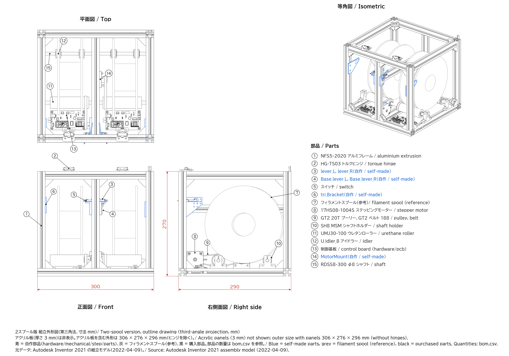

# Mechanical parts / 機構部品

[日本語](#日本語) | [English](#english)

---

## 日本語

| ファイル | 内容 |
|:--|:--|
| [../../docs/images/assembly_outline.png](../../docs/images/assembly_outline.png) | 2スプール版の組立外形図（正面図、平面図、右側面図、等角図、部品番号） |
| [../../docs/images/feeder_assembly_render.jpg](../../docs/images/feeder_assembly_render.jpg) | 2スプール版のレンダリング画像 |
| [step/parts/](step/parts/) | 自作部品の STEP（Base_lever_L/R、lever_L/R、MotorMount、tri_Bracket） |
| [bom.csv](bom.csv) | 部品表 |
| [assembly_parts.csv](assembly_parts.csv) | 組立モデル（Autodesk Inventor、2022-04-09）に含まれていた部品と数量 |

全体組立の STEP（assy_top_dual.stp）は、購入部品のメーカー提供 3D モデルを含んでいたため、2026年に削除しました。代わりに組立外形図と部品表を置いています。購入部品の 3D モデルは、部品表の型番で各メーカーから入手してください。

assembly_parts.csv と bom.csv には一致しない項目があります。NFS5-2020-230 とスペーサー M3 10mm は bom.csv に記載がなく、NFS5-2020-250、NETW8、コーナーブラケットは数量が異なります。

自作部品は精度を必要としないので、3D プリンタでの製作を想定しています。

駆動系: モーター（17HS08-1004S）の GT2 20歯プーリーから、GT2 無端ベルト 188mm をウレタンローラー（外径30mm）に直接巻き掛けています。ローラー側にプーリーはありません。詳しくは [docs/principle.md](../../docs/principle.md) を参照してください。

---

## English

| File | Contents |
|:--|:--|
| [../../docs/images/assembly_outline.png](../../docs/images/assembly_outline.png) | Outline drawing of the two-spool version (front, top, right side, isometric, part numbers) |
| [../../docs/images/feeder_assembly_render.jpg](../../docs/images/feeder_assembly_render.jpg) | Rendering of the two-spool version |
| [step/parts/](step/parts/) | STEP files of the self-made parts (Base_lever_L/R, lever_L/R, MotorMount, tri_Bracket) |
| [bom.csv](bom.csv) | Bill of materials |
| [assembly_parts.csv](assembly_parts.csv) | Parts and quantities in the assembly model (Autodesk Inventor, 2022-04-09) |

The complete assembly STEP (assy_top_dual.stp) was removed in 2026 because it contained manufacturer 3D models of purchased parts. The outline drawing and the bills of materials replace it. Get the 3D models of purchased parts from their manufacturers by the part numbers in the BOM.

assembly_parts.csv and bom.csv do not fully agree: NFS5-2020-230 and the M3 10 mm spacers are not in bom.csv, and the quantities of NFS5-2020-250, NETW8 and the corner brackets differ.

The self-made parts need no high precision and are meant to be 3D printed.

Drive: a GT2 20T pulley on the motor (17HS08-1004S) drives a GT2 closed-loop belt of 188 mm that runs directly on the urethane roller (outer diameter 30 mm). There is no pulley on the roller. See [docs/principle.md](../../docs/principle.md).
