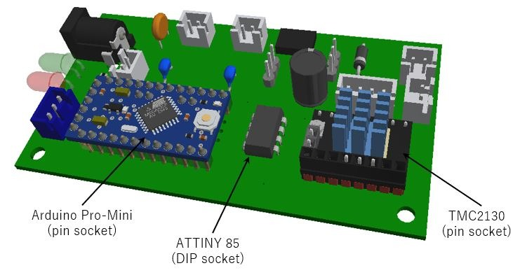

# Control board / 制御基板

[日本語](#日本語) | [English](#english)

---

## 日本語

### ファイル

| ファイル | 内容 |
|:--|:--|
| [eagle/spool_tmc2130_b.sch](eagle/spool_tmc2130_b.sch) | 回路図 rev.B（Autodesk Fusion から EAGLE 9.7.0 形式で書き出し、XML） |
| [eagle/spool_tmc2130_b.brd](eagle/spool_tmc2130_b.brd) | 基板 rev.B（同上、2層、50 × 90 mm） |
| [spool_tmc2130_b_schematic.pdf](spool_tmc2130_b_schematic.pdf) | 回路図 rev.B の PDF（A3） |
| [bom.csv](bom.csv) | 部品表（rev.A の実装品と rev.B） |

EAGLE データは Autodesk Fusion の Electronics で開けます。KiCad でも取り込めます。配線とピン割り当ては [docs/wiring.md](../../docs/wiring.md) にあります。上の画像は rev.A の基板です。

rev.A（製作済み。発注に使ったデータ）は、タグ [`pcb-rev.A`](https://github.com/atsukita1969/filament-spool-feeder/tree/pcb-rev.A/hardware/pcb) から取り出せます。

### rev.A と rev.B に共通の注意点

- GND は配線ではなく表裏のベタだけで接続しています。
- リレー K1 のコイルは 5V 駆動です。部品は G6K-2P-Y **DC5** を使ってください（DC12 品は 5V では動作しません）。

### rev.B の変更点

| # | 変更 | 理由 |
|:--|:--|:--|
| 1 | X5 の2番と JP2 の1番を EXT_IN から外し、新しいネット EXT_SENSE として ATtiny85 PB4（3番ピン）へ接続。R5（10kΩ）でプルダウン | 外部センサーの異常でモーター電源を切れるようにするため（rev.A では ATtiny85 の出力と衝突して機能しない）。HIGH = 正常、LOW または断線 = 異常。JP2 の1-2 短絡で「外部センサーなし」 |
| 2 | EXT_SENSE と PB4 の間に R6（10kΩ）を直列に追加 | X5 に 5V を超える電圧（最大 12V）が加わっても、ATtiny85 の入力保護ダイオードに流れる電流を約 0.65mA に抑えるため |
| 3 | T1 を DTC144EKA から DTC123JKA に変更（同じ SMT3、同じ端子配置） | 入力電流が 68〜126µA から 1.45〜2.69mA に増え、コイル電流 21.1mA で確実に飽和する |
| 4 | R2 を 680Ω から 2.2kΩ に変更 | 抵抗の損失を約 0.045W に下げる |
| 5 | D3 を D4 ネットから外し、Pro Mini D8 → D3 → R4 → GND で駆動。R4 を 150Ω から 470Ω に変更 | X9 にどの種類のセンサーでも接続できるようにし、LED で状態を表示するため。D8 の電流は約 6mA |
| 6 | チップ抵抗 R1〜R6 を 0603 から 0805（2012）に変更 | 手はんだをしやすくするため |

部品の配置：R5 は X5 の近く、R6 は U2 の近くにあります。R2 と R3 は表面、ほかのチップ部品（R1、R4、R5、R6、T1、U1）は裏面です。

### rev.B の使い方

- ATtiny85 のファームは `EXT_SENSE_ENABLED` を 1 にして書き込みます（[firmware/](../../firmware/)）。
- 外部センサーを使わないときは、JP2 の1-2 を短絡します。
- X5 には、正常なときに2番を HIGH にするセンサーをつなぎます。例：1-2 間の常閉接点（正常で閉じ、異常や断線で開く）、または 5〜12V を出力するセンサー。NPN オープンコレクタ出力は HIGH を出せないので、そのままでは使えません。

### rev.B の確認

- DRC は、GND の小さい SMD パッド5か所（T1 のE、R1・R3・R4・R5 の1番）で「銅箔幅」を報告します。パッドの短辺（1.0〜1.03mm）が GND ネットクラスの最小幅 1.524mm より細いためで、パッドはベタに直接つながっています。ほかのエラーはありません。
- 製造データ（CAM 出力のガーバー）の銅箔を解析し、26 ネットすべてが設計どおりにつながり、ショートや孤立した銅箔がないことを確かめました。

### rev.A（製作済み）の注意点

- T1（DTC144EKA）はデータシート上の駆動能力に余裕がありません。実機では動いていますが、rev.B で変更しました。
- R2（680Ω、0603）は 12V で約 0.15W 消費し、一般的な 0603 抵抗の定格 0.1W を超えます。
- ATtiny85 を実装したまま JP2 を短絡しないでください。
- 以前公開していた DesignSpark 版のデータは、EAGLE からの変換時に GND ベタが GND ネットから外れていたため削除しました。タグ `v1.0-2023` から参照できます。

ファームは rev.A と rev.B の両方に対応しています（[firmware/](../../firmware/)）。

---

## English

### Files

| File | Contents |
|:--|:--|
| [eagle/spool_tmc2130_b.sch](eagle/spool_tmc2130_b.sch) | Schematic rev.B (exported from Autodesk Fusion in EAGLE 9.7.0 format, XML) |
| [eagle/spool_tmc2130_b.brd](eagle/spool_tmc2130_b.brd) | Board rev.B (same format, 2 layers, 50 × 90 mm) |
| [spool_tmc2130_b_schematic.pdf](spool_tmc2130_b_schematic.pdf) | Schematic rev.B as PDF (A3) |
| [bom.csv](bom.csv) | Bill of materials (rev.A as built and rev.B) |

The EAGLE files open in Autodesk Fusion Electronics and can be imported into KiCad. Wiring and pin assignment are in [docs/wiring.md](../../docs/wiring.md). The picture above shows the rev.A board.

rev.A (built; the data used for fabrication) is available in tag [`pcb-rev.A`](https://github.com/atsukita1969/filament-spool-feeder/tree/pcb-rev.A/hardware/pcb).

### Notes for both rev.A and rev.B

- GND is connected only through the top and bottom copper pours, not by traces.
- The coil of relay K1 is driven from 5 V. Use G6K-2P-Y **DC5** (the DC12 version does not operate on 5 V).

### Changes in rev.B

| # | Change | Reason |
|:--|:--|:--|
| 1 | Disconnect X5 pin 2 and JP2 pin 1 from EXT_IN and route them as a new net EXT_SENSE to ATtiny85 PB4 (pin 3), with a 10 kΩ pull-down R5 | Lets an external sensor cut the motor supply (on rev.A it conflicts with the ATtiny85 output and does not work). HIGH = OK, LOW or broken wire = fault. JP2 1-2 fitted = no external sensor |
| 2 | Add R6 (10 kΩ) in series between EXT_SENSE and PB4 | Limits the current into the input protection diode of the ATtiny85 to about 0.65 mA when more than 5 V (up to 12 V) is applied to X5 |
| 3 | T1: DTC144EKA → DTC123JKA (same SMT3 package and pinout) | Input current rises from 68–126 µA to 1.45–2.69 mA, so the transistor saturates reliably at the 21.1 mA coil current |
| 4 | R2: 680 Ω → 2.2 kΩ | Reduces the resistor dissipation to about 0.045 W |
| 5 | Disconnect D3 from the D4 net and drive it from Pro Mini D8 → D3 → R4 → GND; R4: 150 Ω → 470 Ω | Any type of sensor can then be used on X9, and the LED shows the status. D8 current about 6 mA |
| 6 | Chip resistors R1–R6: 0603 → 0805 (2012) | Easier hand soldering |

Placement: R5 is near X5 and R6 is near U2. R2 and R3 are on the top side; the other chip parts (R1, R4, R5, R6, T1, U1) are on the bottom side.

### Using rev.B

- Flash the ATtiny85 with `EXT_SENSE_ENABLED` set to 1 ([firmware/](../../firmware/)).
- Fit JP2 1-2 when no external sensor is used.
- Connect a sensor to X5 that drives pin 2 HIGH when everything is OK, for example a normally closed contact between pins 1 and 2 (closed = OK, open or broken wire = fault), or a sensor with a 5–12 V output. An NPN open-collector output cannot drive HIGH and does not work as is.

### Checks on rev.B

- The DRC reports "copper width" at five small GND SMD pads (T1 E, pin 1 of R1, R3, R4 and R5). The short side of these pads (1.0–1.03 mm) is narrower than the 1.524 mm minimum width of the GND net class; the pads are connected directly to the pour. There are no other errors.
- The copper of the manufacturing data (Gerber files from the CAM processor) was analysed: all 26 nets are connected as designed, with no shorts and no isolated copper.

### Notes on rev.A (built)

- T1 (DTC144EKA) has no guaranteed drive margin according to its datasheet. It works on the built boards but was changed in rev.B.
- R2 (680 Ω, 0603) dissipates about 0.15 W at 12 V, above the 0.1 W rating of a standard 0603 resistor.
- Do not fit JP2 while the ATtiny85 is installed.
- The DesignSpark files published earlier were removed because the GND pour lost its connection to the GND net in the conversion from EAGLE. They are still available in tag `v1.0-2023`.

The firmware supports both rev.A and rev.B ([firmware/](../../firmware/)).
